# Jarkom-Modul-4-D05-2021

## Anggota Kelompok D05

| Nama                          | NRP            |
| ----------------------------- | -------------- |
| Andika Nugrahanto             | 05111940000031 |
| Muhammad Rayhan Raffi Pratama | 05111940000110 |
| Fadhil Dimas Sucahyo          | 05111940000212 |

## VLSM (Variable Length Subnet Masking) - CPT

### Perhitungan Subnet

#### Langkah 1

Pertama-tama jumlah alamat IP yang dibutuhkan ditentukan untuk tiap subnet dan dilakukan labelling netmask berdasarkan jumlah IP yang dibutuhkan.

| Subnet | Jumlah IP | Netmask |
| :----: | :-------: | :-----: |
|   A1   |   2021    |   /21   |
|   A2   |    101    |   /25   |
|   A3   |     2     |   /30   |
|   A4   |    701    |   /22   |
|   A5   |     2     |   /30   |
|   A6   |   1001    |   /22   |
|   A7   |     2     |   /30   |
|   A8   |    521    |   /22   |
|   A9   |     2     |   /30   |
|  A10   |    252    |   /24   |
|  A11   |    721    |   /22   |
|  A12   |    502    |   /23   |
|  A13   |    13     |   /28   |
| total  |   5845    |   /19   |

Berdasarkan total IP dan netmask yang dibutuhkan, maka kita dapat menggunakan netmask /19 untuk memberikan pengalamatan IP pada subnet.

#### Langkah 2

Kemudian membuat pohon pembagian subnet seperti ini:

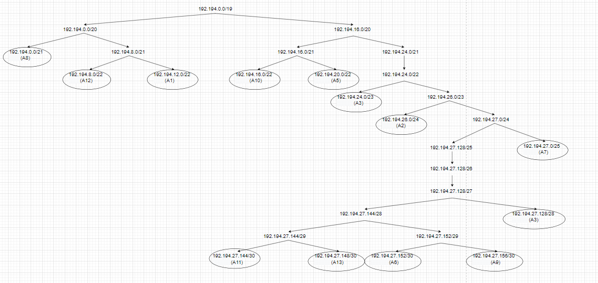

#### Langkah 3

Dilakukan pembaagian IP sehingga didapati tabel dibawah ini:
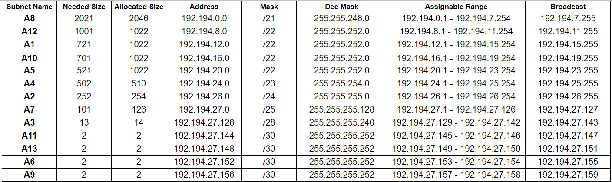

Berikut merupakan gambar topologi yang telah disubnetting:
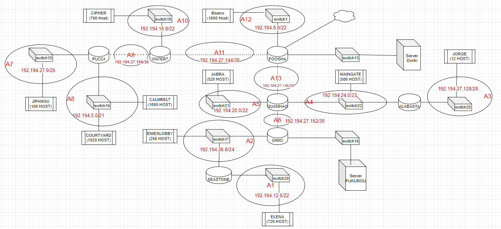

### Routing

#### Subnetting

Pertama-tama, topologi dibuat dalam CPT.

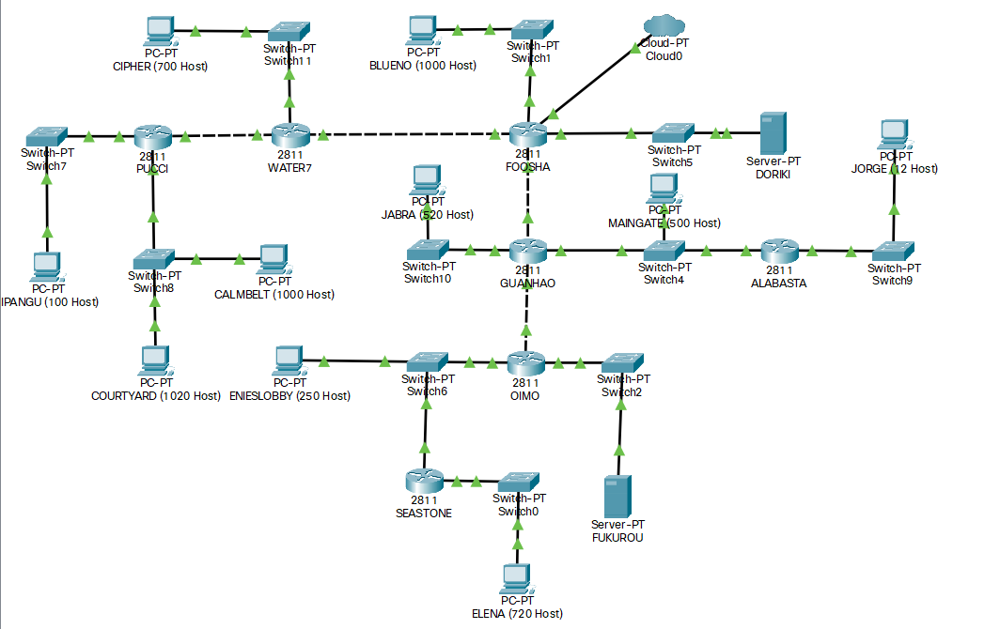

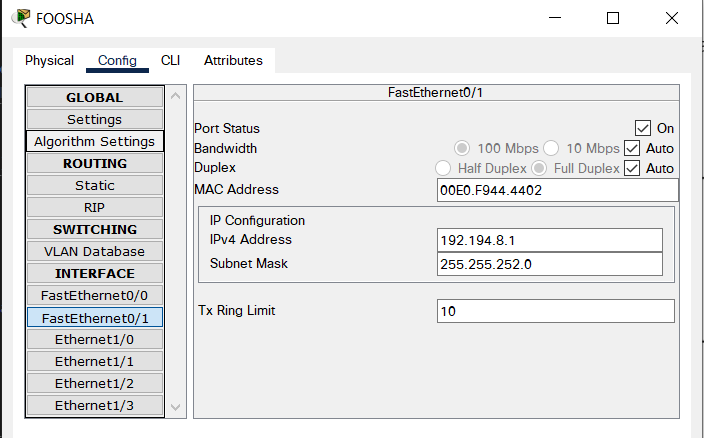
Misal, karena disini `FastEthernet0/1` mengarah ke `Blueno (1000 Host)`, maka kita menggunakan subnet A12 dengan NID `10.19.8.0`. Pada konfigurasi `Foosha`, address untuk `FastEthernet0/1`-nya ditambahi 1 dari NID subnet A12 hingga menjadi `10.19.8.1`.

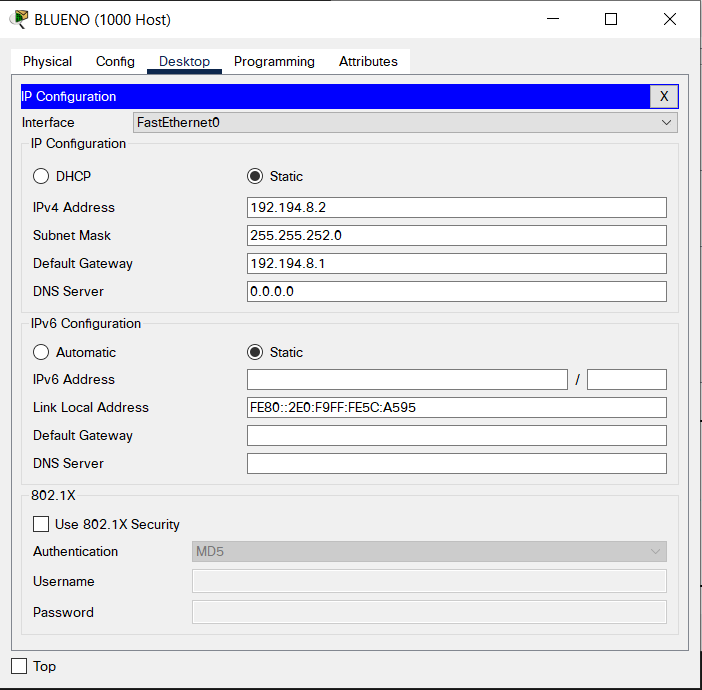
Untuk kliennya, yaitu `Blueno (1000 Host)`, untuk config IP-nya ditambahi 1 lagi dari IP Foosha sehingga menjadi `10.19.8.2`. Untuk netmasknya mengikuti tabel yang telah dibuat sebelumnya. Gateway hanya digunakan untuk klien dan server dan mengarah ke IP router terdekat, jadi gateway untuk klien `Blueno (1000 Host)` adalah `10.19.8.1`.

Hal ini dilakukan pada semua node dan subnetting pun selesai.

#### Routing

Untuk routing pada CPT, diberikan static route pada semua router yang ada dengan route sebagai berikut untuk setiap router:

##### Foosha

```
192.194.27.0/25 via 192.194.27.146
192.194.0.0/21 via 192.194.27.146
192.194.27.156/30 via 192.194.27.146
192.194.16.0/22 via 192.194.27.146
192.194.12.0/22 via 192.194.27.150
192.194.26.0/24 via 192.194.27.150
192.194.27.128/28 via 192.194.27.150
192.194.24.0/23 via 192.194.27.150
192.194.20.0/22 via 192.194.27.150
192.194.27.152/30 via 192.194.27.150
192.194.27.164/30 via 192.194.27.150
```

##### Water7

```
0.0.0.0/0 via 192.194.27.145
192.194.27.0/25 via 192.194.27.158
192.194.0.0/21 via 192.194.27.158
```

##### Pucci

```
0.0.0.0/0 via 192.194.27.157
```

##### Guanhao

```
0.0.0.0/0 via 192.194.27.149
192.194.12.0/22 via 192.194.27.154
192.194.26.0/24 via 192.194.27.154
192.194.27.164/30 via 192.194.27.154
192.194.27.128/28 via 192.194.24.3

```

##### Alabasta

```
0.0.0.0/0 via 192.194.24.1
```

##### Oimo

```
0.0.0.0/0 via 192.194.27.153
192.194.12.0/22 via 192.194.26.3
```

##### Seastone

```
0.0.0.0/0 via 192.194.26.1
```

### Testing

Testing pada CPT dapat dilakukan dengan tombol Add Simple PDU yang dilambangkan dengan icon pesan pada top navigation.

1. Client Elena ke Client Blueno
   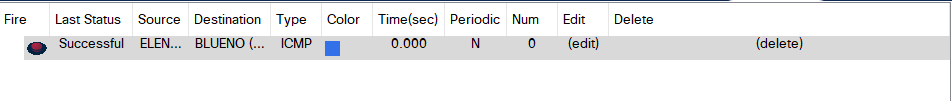
2. Client Cipher ke Router Alabasta
   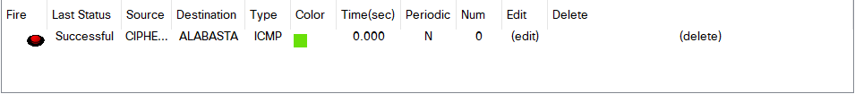
3. Router Pucci ke Router Seastone
   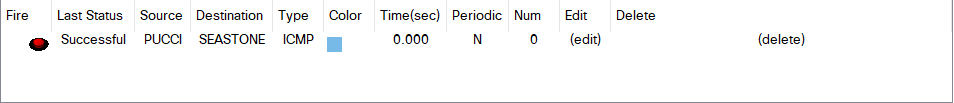

## CIDR (Classless Inter Domain Routing) - GNS3

#### Langkah 1

### Perhitungan Subnet

Menggabungkan subnet-subnet paling bawah dalam topologi, berikut penggabungannya:

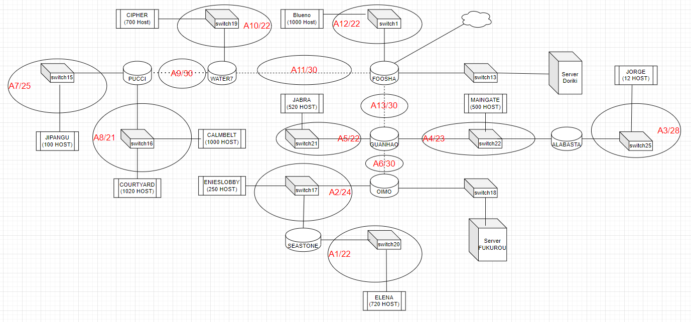
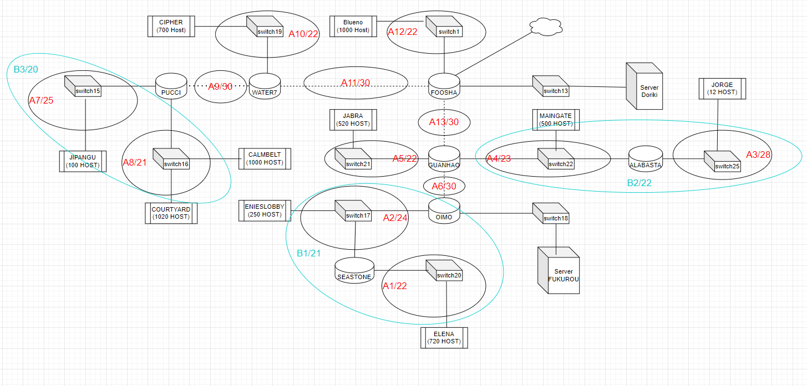
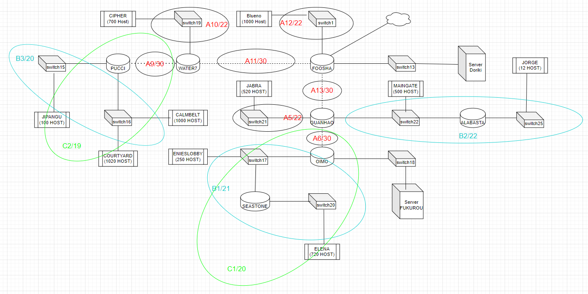
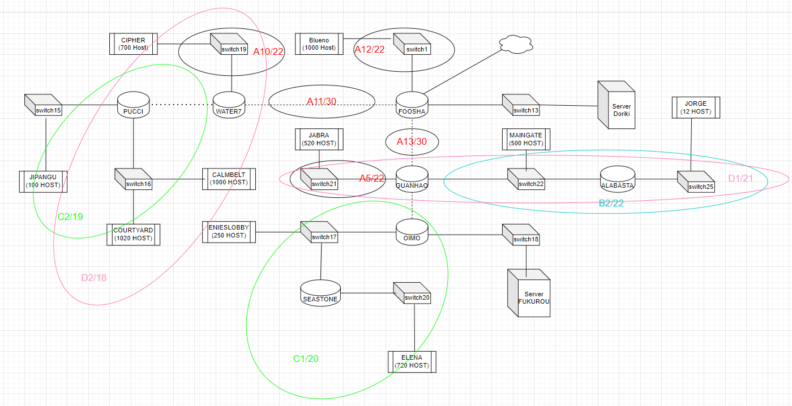
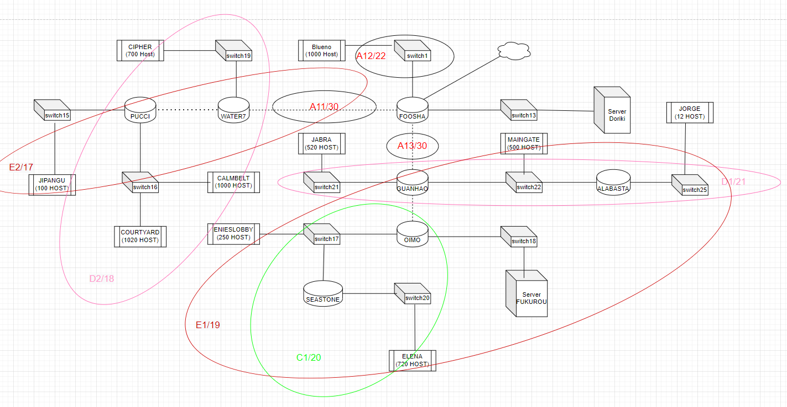
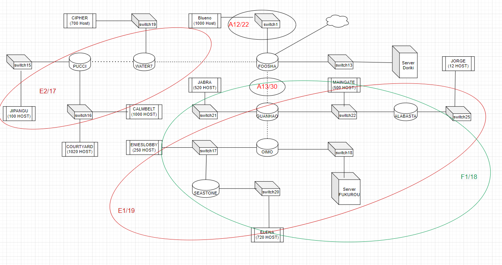
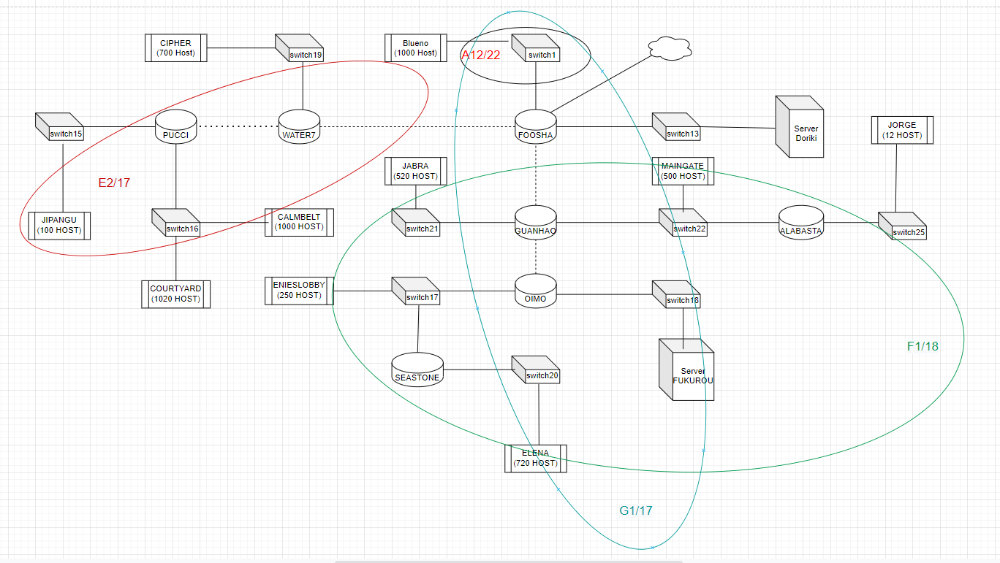
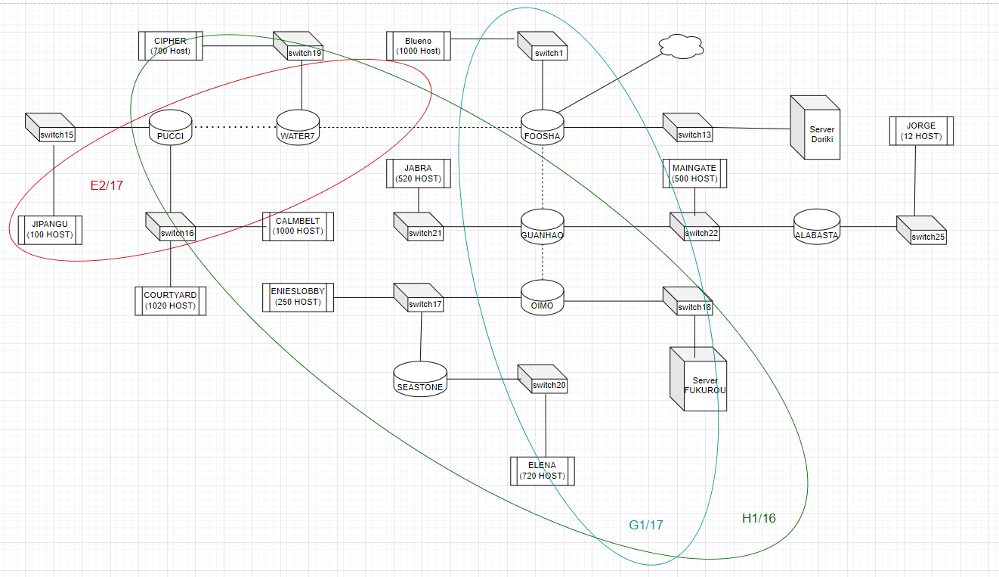

#### Langkah 2

Sehingga di dapatkan berikut pohon pembagian IP berdasarkan penggabungan subnet yang telah dilakukan:

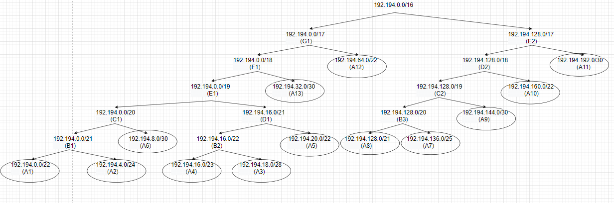

#### Langkah 3

Dilakukan pembaagian IP sehingga didapati tabel dibawah ini:
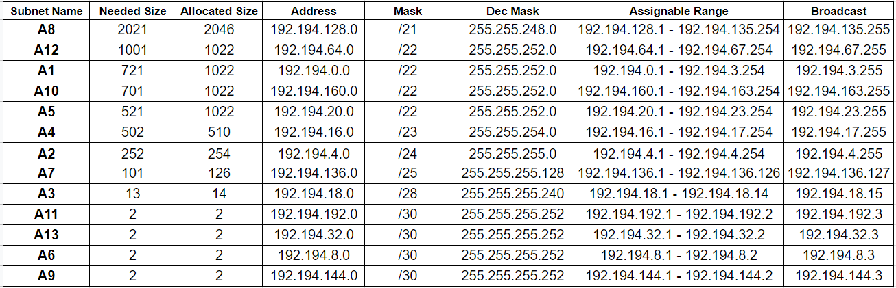

Berikut merupakan gambar topologi yang telah disubnetting:

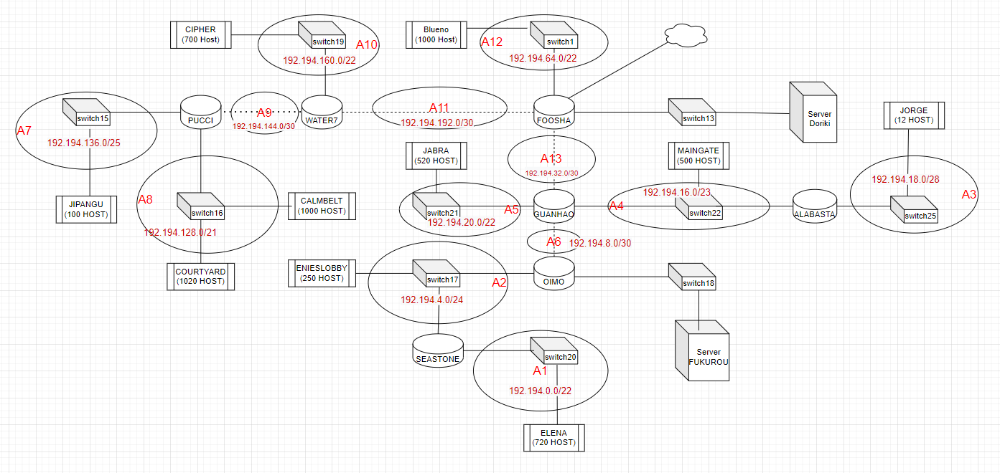

### Routing

#### Subnetting

Pertama-tama, topologi dibuat dalam GNS3.

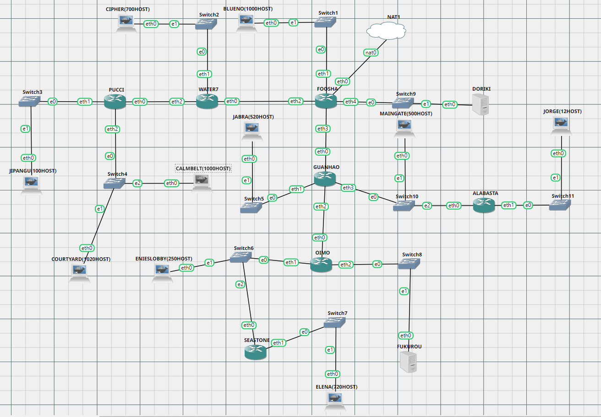

Lalu setiap node dikonfigurasi dengan cara `Configure > Edit Network Configuration`. Berikut merupakan salah satu contoh, yaitu menggunakan node `Foosha`:

Pada `Edit Network Configuration` Foosha, isi konfigurasi masing-masing jalur berdasarkan subnetting yang sudah dibuat sebelumnya:

```
auto eth0
iface eth0 inet static
address 192.168.122.2
netmask 255.255.255.0
gateway 192.168.122.1

auto eth1
iface eth1 inet static
address 192.194.64.1
netmask 255.255.252.0

auto eth2
iface eth2 inet static
address 192.194.192.1
netmask 255.255.255.252

auto eth3
iface eth3 inet static
address 192.194.32.1
netmask 255.255.255.252
```

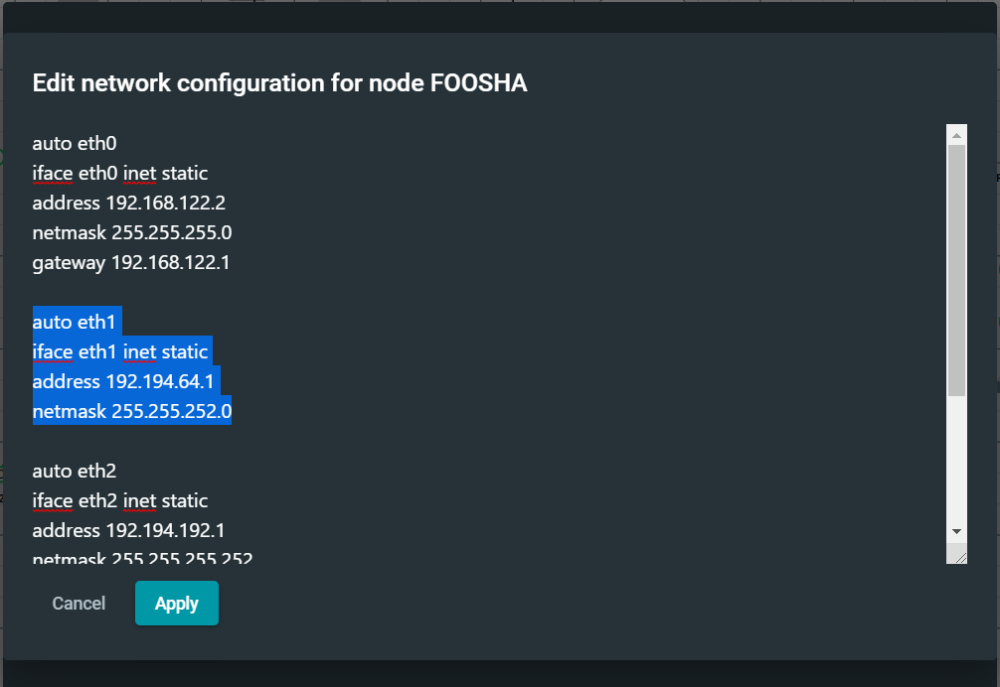
Misal, karena disini `eth1` mengarah ke `Blueno (1000 Host)`, maka kita menggunakan subnet A12 dengan NID `192.194.64.0`. Pada konfigurasi `Foosha`, address untuk `eth1`-nya ditambahi 1 dari NID subnet A6 hingga menjadi `192.194.64.1`.

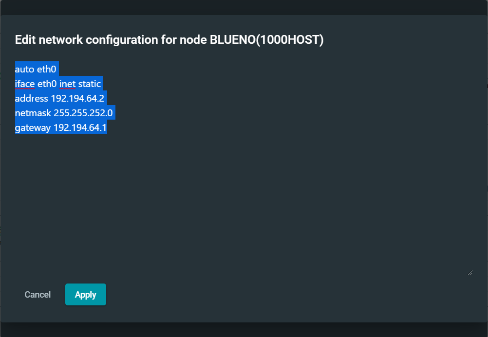
Untuk kliennya, yaitu `Blueno (1000 Host)`, address untuk `eth0`-nya ditambahi 1 lagi dari IP Foosha sehingga menjadi `192.194.64.2`. Untuk netmasknya mengikuti tabel yang telah dibuat sebelumnya. Gateway hanya digunakan untuk klien dan server dan mengarah ke IP router terdekat, jadi gateway untuk klien `Blueno (1000 Host)` adalah `192.194.64.1`.

Hal ini dilakukan pada semua node dan subnetting pun selesai.

Agar dapat mengakses internet, pada **FOOSHA** diketikkan perintah

```
iptables –t nat –A POSTROUTING –o eth0 –j MASQUERADE –s 192.194.0.0/16
```

Selain itu jangan lupa untuk menambahkan kode ini juga pada setiap node agar dapat terhubung ke internet:

```
echo nameserver 192.168.122.1 > /etc/resolv.conf
```

#### Routing

Kemudian pada 4 router yaitu **FOOSHA**, **WATER7**, **GUANHAO**, dan **OIMO** ditambahkan route baru (pada router lain tidak perlu, karena hanya memerlukan route 0.0.0.0/0 di mana secara otomatis tersetting).

Routing menggunakan CIDR jauh lebih sederhana karena mereka sudah terkelompokkan dari pembagian IP-nya, sehingga untuk setiap Router memerlukan dari gabungan subnet berikut:

- **FOOSHA** = A12, E2, F1
- **WATER7** = A10, C2
- **GUANHAO** = A5, B2, C1
- **OIMO** = B1

##### Foosha

```
route add -net 192.194.64.0 netmask 255.255.252.0 gw 192.194.64.2
route add -net 192.194.128.0 netmask 255.255.128.0 gw 192.194.192.2
route add -net 192.194.0.0 netmask 255.255.192.0 gw 192.194.32.2
```

##### Water7

```
route add -net 192.194.160.0 netmask 255.255.252.0 gw 192.194.160.2
route add -net 192.194.128.0 netmask 255.255.224.0 gw 192.194.144.2
```

##### Guanhao

```
route add -net 192.194.20.0 netmask 255.255.252.0 gw 192.194.20.2
route add -net 192.194.16.0 netmask 255.255.252.0 gw 192.194.16.2
route add -net 192.194.16.0 netmask 255.255.252.0 gw 192.194.16.3
route add -net 192.194.0.0 netmask 255.255.240.0 gw 192.194.8.2
```

##### Oimo

```
route add -net 192.194.0.0 netmask 255.255.248.0 gw 192.194.4.2
route add -net 192.194.0.0 netmask 255.255.248.0 gw 192.194.4.3
```

#### Testing

Setup pun selesai dan kita bisa melakukan testing ping antar node, berikut merupakan beberapa contoh ping:

1. Client Elena ke Client Blueno
   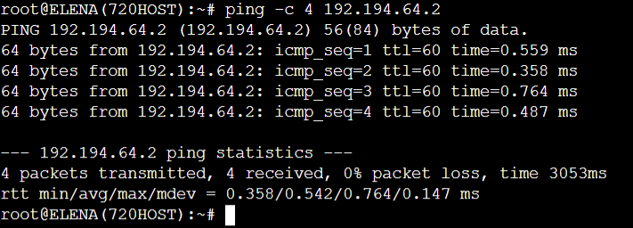
2. Client Cipher ke Router Alabasta
   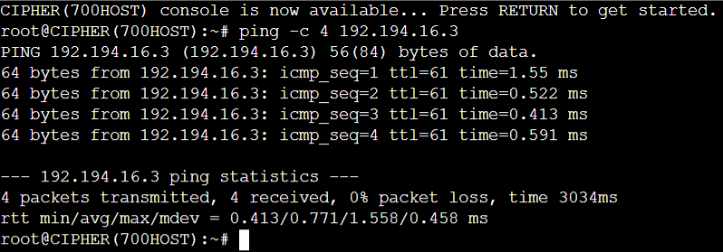
3. Router Pucci ke Router Seastone
   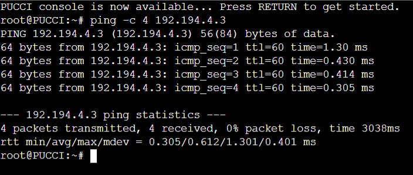
4. Client Elena ke my.its.ac.id
   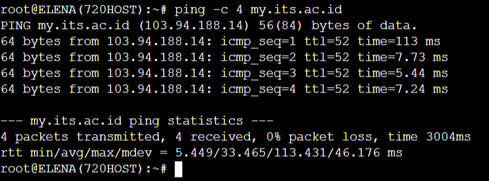

   ping yang dilakukan adalah ke my.its.ac.id karena jika melakukan ping ke its.ac.id akan terjadi `Request Timed Out`
   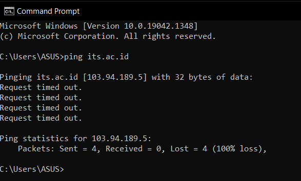
